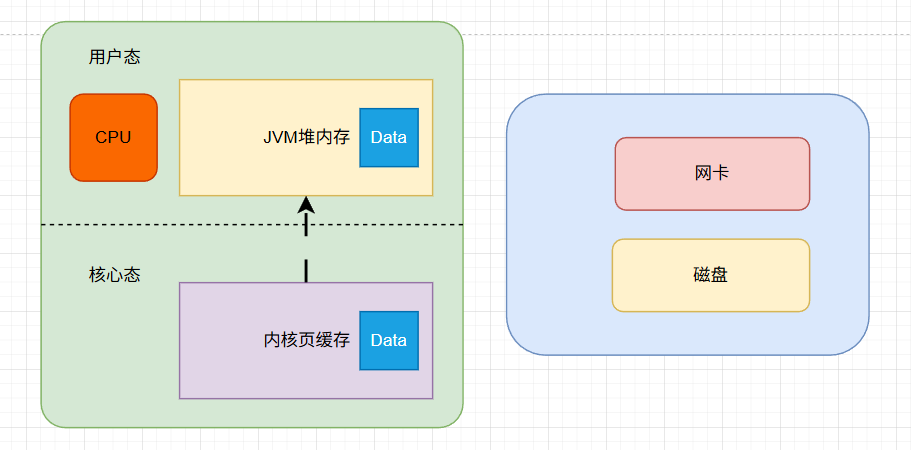
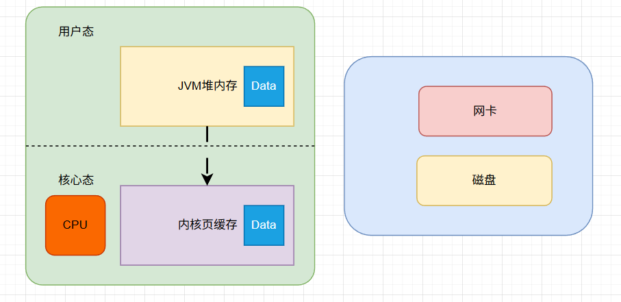

# NIO基础

## 操作系统底层基石

### 权限与内存分层

用户态 (User Space)：JVM 及 Java 程序运行的区域，受权限限制，无法直接访问硬件。

内核态 (Kernel Space)：操作系统内核运行的区域，拥有最高权限，直接驱动磁盘、网卡和 CPU。

系统调用 (System Call)：用户态程序向内核申请资源（如读写文件）时的“身份切换”过程.每次调用都会产生昂贵的上下文切换开销。

### 没有DMA时的CPU读操作

在DMA出现之前，操作系统采用的是PIO（Programmed I/O，编程 IO）模式。此时的CPU既是大脑，又是唯一的搬运工。

操作步骤：

发出指令：CPU 向磁盘控制器发出读取指令，要求读取某个扇区的数据。

轮询等待 (Polling)：由于磁盘太慢，CPU 必须不断地询问磁盘：“好了吗？好了吗？”。在这个过程中，CPU 无法执行其他计算任务，处于忙等状态。

逐字节搬运：磁盘数据准备好后，放在磁盘控制器的缓冲区（通常只有几个字节）。

CPU 亲自劳动：CPU 必须执行一条指令，从硬件寄存器里读出 1 个字节，再执行一条指令，把它存入内存。

循环往复：如果要读 1024 字节，CPU 就要手动循环搬运 1024 次。

 

结论：在没有 DMA 的年代，IO 操作会占用 100% 的 CPU。即便数据只是在路途上，CPU 也得在那儿守着，极大地浪费了算力。

### DMA (直接内存存取)

机制：允许硬件（如磁盘、网卡）直接与内存交换数据，而无需 CPU 全程参与搬运。

价值：CPU 仅需下达指令，数据搬运由 DMA 硬件完成，在完成后告诉CPU即可，极大释放了 CPU 算力。

 特点：DMA传输的数据会放到**内存核心区**，也就是说java程序如果想要使用，需要进入内核去。

## 传统 BIO 的瓶颈

### 四次拷贝与四次切换

在传统 BIO (InputStream/OutputStream) 中，进行一次“读取再发送”的操作（如文件拷贝），底层路径极其冗长：

普通状态下的计算机底层

#### 第一步：用户态 ---> 内核态

io操作必须让cpu进入核心态才能发出read()系统调用，因此cpu进行了**第一次**的状态转换。

#### 第二步：磁盘 ---> 内核缓冲区

DMA将数据搬运到内核空间的Page Cache。数据从磁盘**拷贝**到内核缓存页，这是**第一次拷贝**

#### 第三步：内核缓冲区 ---> 用户缓冲区

（第一次 CPU 冗余拷贝） CPU 将数据从内核空间**拷贝**到 JVM 堆内存，并由内核态**切换**回用户态，程序才能处理数据。
**在这里发生了第二次拷贝和第二次切换**

#### 第四步：用户缓冲区 ---> Socket 缓冲区

（第二次CPU冗余拷贝） 程序发起 write()**切换**进入内核，CPU将数据从 JVM **拷贝**回内核空间的 Socket Buffer。

**在这里发生了第三次状态切换与第三次拷贝**

#### 第五步：Socket 缓冲区 ---> 硬件

DMA将数据**拷贝**到网卡，完成后**切换**回用户态。

**在这里发生了第四次的拷贝和第四次的状态切换**

### Buffer 批量读取操作

假设此时我们需要读取一个1024B(字节)的文件，在使用和不使用buffer的区别又是什么那？

对于一个1024B读入操作，普通不使用buffer的BIO操作，每一次操作的单位是1字节，也就是说会发生1024 * 4次的状态切换。这是一个巨大的性能问题。

但如果使用了buffer，对于步骤1，3，4可以直接一次性拷贝，由原来1个字节1个字节拷贝共1024次操作，变成了一次性拷贝1024个字节的1次操作。性能提升了原来的1/1024倍。

在步骤二的时候，内核通过DMA从磁盘搬运时，通常会以 “页” (Page) 为单位（通常是 4KB）。也就是说，无论如何并不是1个字节1个字节的从磁盘读取到内核空间。而是一次性将4KB的数据读取到内核空间。因此步骤二只运行了1次。

BIO + Buffer：虽然步骤 1、3、4 的切换次数减少了，但步骤2和3之间那次 CPU 拷贝（内核 ---> 用户）依然存在。CPU还是得把这1024字节从内核搬到JVM堆。

NIO (transferTo)：不仅状态切换次数少，而且完全去掉了步骤2和3之间的那次 CPU 拷贝。

## 零拷贝 (Zero-Copy)

NIO的核心在于砍掉了中间不必要的“跨空间搬运”。

### transferTo 的魔法（数据指针）

在FileChannel.transferTo()过程中，内核不再将数据拷贝到用户态。

实现原理：内核仅将文件在Page Cache的物理内存地址（指针）和长度信息追加到Socket缓冲区的描述符中。

结果：网卡直接根据指针从Page Cache “取货”。数据全程不出内核，实现了真正的“零”冗余拷贝。

 

### MappedByteBuffer (mmap)

原理：将磁盘文件直接映射到用户态和内核态共享的一块虚拟内存地址上。

优势：Java 修改这块内存，内核立即可见，省去了 read/write 的系统调用和跨空间拷贝。

 

## Buffer, Channel, Selector

### Buffer (缓冲区)

本质：一块内存数组，是数据的载体。

三大指针：

Capacity：容量上限。

Position：当前读写位置。

Limit：有效数据的界限。

关键动作：flip()。将写模式切换为读模式，通过移动指针让程序能读取到刚才写入的内容。

### Channel (通道)

特性：双向性。不同于BIO流的单向，一个Channel既能读也能写。

模式：面向Buffer。所有数据必须通过Buffer进出Channel。

### Selector (选择器) —— 并发之魂

IO多路复用：允许一个线程同时监听成千上万个Channel的事件（如 Accept, Read）。

非阻塞模式：当 Channel 没数据时，读写方法立即返回，线程无需死等（挂起），可立即处理其他就绪的 Channel。

## 面试总结

### 零拷贝的局限性

如果需要对数据进行加工如加密、转大写，**零拷贝失效**。因为CPU必须在用户态执行Java逻辑，数据必须进入JVM。

也就是说，如果程序不只是拷贝，还有加工处理，那么就不在零拷贝的范围内了。但是nio的高性能还是存在的。

对策：此类场景应选用 mmap 或 DirectBuffer 以尽量减少拷贝次数。

 

### 为什么 NIO 更快？

底层视角：减少了CPU在内存间的无谓搬运，减少了昂贵的上下文切换。

架构视角：一个线程管理海量连接，避免了 BIO “一线程一连接”导致的内存溢出和线程切换开销。

### 如何选择 IO 模型？ 

BIO：适用于连接数少、大文件传输、逻辑简单的内部系统。 

NIO：适用于高并发、海量短连接的互联网应用（如 IM 聊天室、Web 服务器核心）。