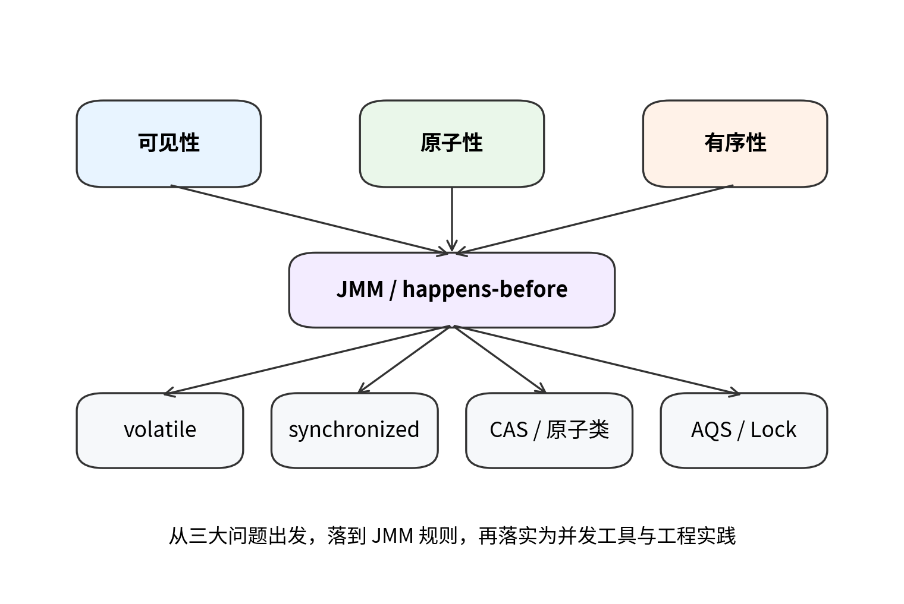
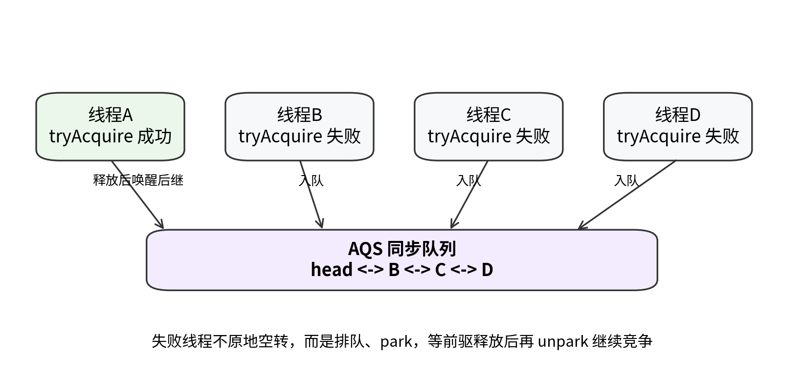
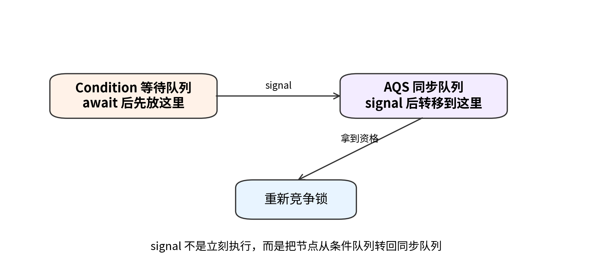
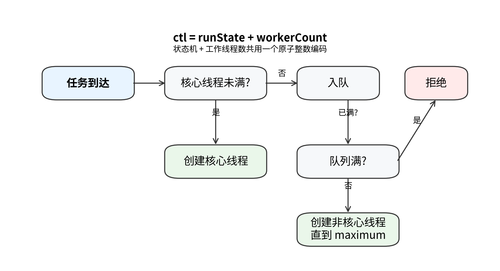
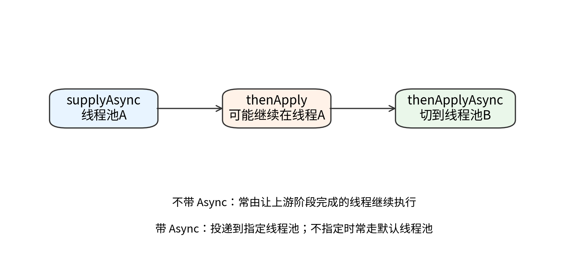
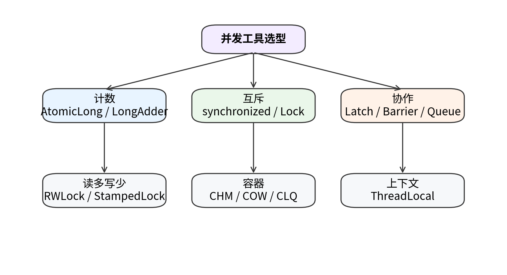

# JUC 学习手册

> 参考《Java 并发编程的艺术》的主线，结合常见 JUC 课程笔记的讲法，对原笔记做重构、补漏与扩展。




## 基础

JUC 的绝大多数主题，最终都可以归结到三个基本问题：可见性（visibility）原子性（atomicity）有序性（ordering）

### 可见性

看下面这个例子：

```java
class Demo {
    boolean stop = false;

    void shutdown() {
        stop = true;
    }

    void work() {
        while (!stop) {
            // busy loop
        }
    }
}
```

如果一个线程执行 `shutdown()`，另一个线程执行 `work()`，直觉上应该能停下来。但实际不一定。

原因在于：线程执行时，不会每次都直接去主内存取最新值。为了性能，处理器缓存、寄存器、编译器优化和运行时系统都会尽量减少昂贵的共享内存访问。于是可能出现：

- 线程 A 已经把 `stop` 改成了 `true`
- 线程 B 仍旧在本地视图里看到 `false`
- B 永远不退出循环

这就是可见性问题。

注意，可见性问题不是“写失败了”，而是：

> 写成功了，但别的线程观察到它的时机没有保证。

并发里很多 bug，不是逻辑推导错了，而是一个线程活在“旧世界”里。

### 原子性

再看一个更常见的例子：

```java
count++;
```

它在源码里是一行，在机器层面通常不是一步。至少可以分成：

1. 读取 `count`
2. 执行加一
3. 写回结果

如果两个线程同时做这三步，就可能出现：

- 线程 A 读到 10
- 线程 B 也读到 10
- A 写回 11
- B 再写回 11

结果少加了一次。

这里问题不在于“看不见”，而在于：

> 这组操作执行到中间时，被别的线程插进来了。

所以原子性的本质是：

> 某一组逻辑，要么整体完成，要么根本不暴露中间态给其他线程破坏。

### 有序性

程序员写代码有顺序，但编译器和 CPU 为了优化性能，会在不违反单线程语义的前提下进行重排序。

单线程里，这通常没问题，因为最终结果保持一致就行。这种优化常被称为 **as-if-serial**：

> 不管内部怎么优化，对单线程观察来说，效果就像按原顺序执行一样。

但多线程里，“像单线程一样”就不够了。因为另一个线程可能在中间观察你的状态。

经典例子是双重检查单例：

```java
instance = new Singleton();
```

它在逻辑上像一件事，但底层大致可能拆成：

1. 分配内存
2. 初始化对象
3. 将引用赋给 `instance`

如果 2 和 3 重排序，另一个线程就可能看到：

- `instance != null`
- 但对象状态还没初始化完成

这就是有序性问题。

---

## JMM

很多人学 JMM 时最大的误区，是把它当成 JVM 内存结构图来背。实际上，JMM 不是讲堆、栈、方法区，也不是让你背“主内存/工作内存”几个名词就完事。

JMM（Java Memory Model）真正要回答的问题是：

> 在 Java 里，多线程程序对共享变量的读写，什么行为是有保证的，什么行为是没有保证的。

**它是并发语义的总规则**，而不是一张结构示意图。

### 3.1 为什么必须有 JMM

不同硬件平台的内存模型、缓存一致性协议、处理器指令执行方式并不相同。编译器也会做不同优化。如果 Java 语言层不定义统一并发语义，那么同样一段并发代码可能在不同机器上表现不同。

JMM 的目的就是：

- 屏蔽底层平台差异
- 给 Java 程序员一个统一的推理框架
- 规定哪些同步原语能够建立可靠的可见性与顺序约束

也就是说，JMM 是语言层面对多线程“交通规则”的定义。

### 3.2 主内存 / 工作内存模型应该怎么理解

JMM 常用一个抽象模型帮助理解：

- **主内存**：共享变量的逻辑存放位置
- **工作内存**：线程使用共享变量时的本地视图或副本

重点不是背术语，而是理解含义：

> 线程并不总是直接操作唯一的共享真值，而经常是在本地副本和共享状态之间同步。

于是问题来了：

- 线程 A 刷新了修改
- 线程 B 还没重新读取
- B 看到的仍是旧值

这就是为什么“变量改了但别人没看见”会真实发生。

注意，这个“工作内存”是语义抽象，不要机械地把它等同于某一块物理硬件内存。

### 3.3 JMM 解决哪些问题，不解决哪些问题

JMM 主要解决：

- 可见性
- 有序性
- 多线程观察行为的一致语义

它不直接替你解决复合逻辑的原子性。原子性通常依赖：

- 锁
- CAS
- 原子类
- 同步器

换句话说，JMM 是底层规则，锁和同步器是建立在这套规则上的工具。

---


### 3.4 数据竞争

很多并发 bug，表面上看是“偶现”，本质上是 **data race（数据竞争）**：

- 至少两个线程访问同一个共享变量
- 其中至少一个是写
- 这些访问之间没有建立可靠的 happens-before 关系

一旦出现数据竞争，你就不能再用单线程直觉推导结果。因为在 JMM 里，**没有同步的共享访问，本来就不承诺你会看到什么顺序、什么时机、什么值**。

所以“正确同步”的程序，真正的标准不是“跑起来大多数时候没问题”，而是：

> 所有跨线程依赖都建立在 happens-before 之上。

这也是为什么并发编程最怕“侥幸正确”。在开发机上连续跑一百次没出错，只能说明冲突还没被触发，不能说明程序是对的。

### 3.5 final

`final` 不只是“不能改”，它还带着一层并发语义：**初始化安全性**。

当一个对象在构造函数里把 `final` 字段初始化好，并且对象在构造完成后被正确发布，那么其他线程读到这个对象时，通常能可靠地看到这些 `final` 字段已经初始化完成的值。

这带来两个重要结论：

1. 不可变对象天然更适合并发
2. 构造过程里不要让 `this` 提前逸出

错误示例：

```java
class Bad {
    final int x;
    static Bad ref;

    Bad() {
        ref = this; // this 逸出
        x = 42;
    }
}
```

这里别的线程可能先拿到 `ref`，再看到 `x` 还没准备好。问题不在 `final` 本身，而在于对象发布时机错了。

### 3.6 安全发布

“对象创建好了”不等于“别人能安全看见”。常见安全发布方式有：

- 通过静态初始化发布
- 通过 `volatile` / 原子引用发布
- 通过锁保护下的共享变量发布
- 把对象放进线程安全容器后发布
- 利用 `final` + 不可变设计降低共享成本

判断一个发布是否安全，可以一直追问自己一句：

> 读这个对象的线程，凭什么一定看得到构造阶段写进去的状态？

没有答案，就说明发布方式还不够扎实。

## HB

如果说 JMM 里只能记一个最重要的概念，那就是 **happens-before**。

它不是单纯的“时间上先发生”，而是一种更强的语义关系：

> 如果 A happens-before B，那么 A 的结果对 B 可见，并且 A 的执行效果在逻辑上先于 B。

这里同时包含了两层意思：

1. **可见性**：A 的结果 B 能看见
2. **顺序约束**：B 不能把对 A 的依赖建立在一个违反规则的顺序上

### 4.1 为什么需要 happens-before

真实机器执行并发程序时，存在：

- 缓存
- 指令乱序
- 编译优化
- 多线程交错

如果没有一套统一规则，你就很难说清楚：

- 某个线程写的数据，凭什么另一个线程一定能看见？
- 某个顺序，凭什么另一个线程可以安全依赖？

happens-before 的价值就在于：

> 它提供了 Java 层的“可依赖先后关系”。

没有 happens-before 的地方，你就不能靠“应该吧”来推理。

### 4.2 几条必须真正掌握的规则

#### 规则一：程序次序规则

在同一个线程中，前面的操作 happens-before 后面的操作。

这条规则让单线程内部逻辑仍然可推理。

#### 规则二：监视器锁规则

对同一把锁的解锁，happens-before 后续对这把锁的加锁。

它意味着：

- 线程 A 释放锁前做的修改
- 线程 B 后续拿到同一把锁后应该能看到

所以锁不仅是互斥工具，还是内存同步工具。

#### 规则三：volatile 变量规则

对一个 `volatile` 变量的写，happens-before 后续对该变量的读。

这就是为什么 `volatile` 能做状态发布。

#### 规则四：线程启动规则

主线程在调用 `Thread.start()` 之前做的事情，对新线程可见。

#### 规则五：线程终止规则

线程中的操作，对其他线程从 `join()` 返回后可见。

#### 规则六：传递性

如果 A happens-before B，B happens-before C，那么 A happens-before C。

这条规则非常重要，因为很多复杂同步关系都是靠传递性串起来的。

### 4.3 如何用 happens-before 判断代码是否可靠

真正的用法不是背条目，而是问自己：

- 这个线程写的数据，另一个线程凭什么一定能看到？
- 靠的是锁？volatile？线程启动/终止？还是根本没有同步规则？
- 如果我回答不出来，那就说明这个可见性未被证明。

并发 bug 很多时候不是工具不够，而是：

> 程序员主观上以为存在 happens-before，但实际上根本没有建立起来。

---

## volatile

`volatile` 是并发里最常被误用的关键字之一。很多人只记得一句：

> volatile 保证可见性。

这句话当然没错，但远远不够。`volatile` 真正有价值的地方包括：

- 可见性
- 作为状态发布信号
- 约束与 volatile 读写相关的关键重排序
- 借助内存屏障语义建立 happens-before

同时，它也有明确边界：

- 不保证复合原子性
- 不适合多步骤条件更新
- 不能替代锁和 CAS

### 5.1 volatile 适合解决什么问题

最典型场景是状态标记：

```java
class Worker {
    private volatile boolean stop = false;

    void shutdown() {
        stop = true;
    }

    void run() {
        while (!stop) {
            // do work
        }
    }
}
```

这里我们需要的是：

- 一个线程更新状态
- 其他线程尽快看到

而不是复合更新。

### 5.2 volatile 为什么能保证可见性

JMM 对 volatile 读写赋予了特殊语义。粗略说：

- 对 volatile 的写，不能只停留在当前线程的本地视图里不被其他线程观察到
- 对 volatile 的读，不能随便一直使用过期副本

因此，volatile 变量的读写被强化成了“带同步语义的内存访问”。

从 happens-before 角度看：

> 线程 A 对某个 volatile 变量的写
> happens-before
> 线程 B 后续对这个变量的读

这意味着只要线程 B 看到了这次写，就应该也能看到在这次写之前由线程 A 完成的相关结果（前提是这些结果位于允许被这次发布语义涵盖的边界之内）。

### 5.3 volatile 为什么还能限制重排序

必须特别强调：

> volatile 不是“禁止所有重排序”，它禁止的是与 volatile 读写边界冲突的危险重排序。

### volatile 写的语义

对一个 volatile 变量执行写时，它之前的普通写不能被重排到这次 volatile 写之后。

例如：

```java
x = 1;
y = 2;
flag = true; // volatile 写
```

这里 `x = 1`、`y = 2` 不能被重排到 `flag = true` 之后。于是另一个线程一旦看到了 `flag == true`，就应该能看到 `x` 和 `y` 的写入结果。

这就是“发布”的经典模式。

### volatile 读的语义

对一个 volatile 变量执行读时，它后面的普通读写不能被重排到这次 volatile 读之前。

例如：

```java
if (flag) { // volatile 读
    int a = x;
    int b = y;
}
```

一旦读到了 `flag == true`，后续对 `x`、`y` 的读取就必须建立在这个已同步的视图之上。

### 5.4 内存屏障到底在做什么

“内存屏障”这个词很容易被讲得很神秘。其实你不需要先去背某个 CPU 平台具体指令名，但必须理解它的作用。

更准确地说，内存屏障不是“魔法刷新缓存”，而是一类 **顺序约束点**：

- 它告诉编译器：某些读写不能越过这个边界乱排
- 它告诉处理器：某些内存操作不能以会破坏 JMM 语义的方式被重新观察
- 它与底层缓存一致性机制配合，帮助建立更可靠的可见性语义

概念上常见几类屏障：

- LoadLoad
- StoreStore
- LoadStore
- StoreLoad

它们分别限制读/写之间的重排。你不必一开始死记这四个名字，但要知道：

> volatile 的实现并不是“关键字自带神力”，而是 JVM 在生成机器码时，通过屏障语义把 JMM 的规则落到硬件执行层。

### 5.5 volatile 经典用法：安全发布一个状态边界

看这个模式：

```java
class Holder {
    int x;
    int y;
    volatile boolean ready;

    void writer() {
        x = 1;
        y = 2;
        ready = true;
    }

    void reader() {
        if (ready) {
            System.out.println(x + y);
        }
    }
}
```

这里 `ready` 不是只是“自己可见”，而是承担了 **发布信号** 的职责。

- 写线程在设置 `ready = true` 前，先完成 `x` 和 `y` 的写
- 读线程一旦观察到 `ready == true`，就应该看到前面已经发布好的结果

这是 volatile 最常见、也最应该掌握的模式之一。

### 5.6 为什么 volatile 不能保证 count++ 原子性

下面代码仍然不安全：

```java
volatile int count = 0;

void incr() {
    count++;
}
```

原因很简单：

- volatile 保证可见性和边界顺序
- `count++` 的问题是 `读 -> 改 -> 写` 三步之间会被别的线程插进来

换句话说：

> volatile 解决的是“看得见”和“不要乱序”，不是“中途不能插队”。

原子性要靠：

- 锁
- CAS
- 原子类
- 同步器

而不是单靠 volatile。

### 5.7 双重检查单例为什么必须配合 volatile

```java
class Singleton {
    private static volatile Singleton instance;

    private Singleton() {}

    static Singleton getInstance() {
        if (instance == null) {
            synchronized (Singleton.class) {
                if (instance == null) {
                    instance = new Singleton();
                }
            }
        }
        return instance;
    }
}
```

这里 volatile 的核心作用是：

- 防止“引用先发布，对象后初始化”这类危险重排序
- 确保其他线程看见非空 `instance` 时，对象已经初始化完成

如果不加 volatile，双重检查可能拿到“半初始化对象”。

### 5.8 volatile 的适用边界

适合：

- 状态标志
- 只写一次/少量写、多量读的配置发布
- 双重检查单例中的引用发布
- 简单的一写多读同步场景

不适合：

- 计数器
- 多字段一致性维护
- 先判断再更新的复合逻辑
- 临界区互斥

理解 `volatile` 的关键不是记住它“很轻量”，而是知道它 **擅长什么，不擅长什么**。

---

## synchronized

`synchronized` 经常被讲成“Java 的内置锁”。这当然对，但还不够。想真正理解它，你至少要把下面几层串起来：

1. 语言层：`synchronized` 表达互斥和同步语义
2. JMM 层：解锁/加锁会建立 happens-before
3. HotSpot 运行时层：对象头、Mark Word、monitor、锁状态优化

### 6.1 synchronized 锁住的到底是什么

`synchronized` 锁住的不是“代码文本”，而是 **某个对象关联的监视器语义**。

三种常见写法：

#### 修饰实例方法

```java
public synchronized void incr() {
    count++;
}
```

锁的是 `this`。

#### 修饰静态方法

```java
public static synchronized void test() {
}
```

锁的是当前类的 `Class` 对象。

#### 修饰代码块

```java
synchronized (lock) {
    count++;
}
```

锁的是 `lock` 指向的对象。

真正决定互斥是否生效的关键不是“有没有 synchronized 关键字”，而是：

> 多个线程竞争的是不是同一把锁。

### 6.2 synchronized 为什么能保证原子性

`count++` 本身不是原子操作，但：

```java
public synchronized void incr() {
    count++;
}
```

在这个方法里，原子性来自于互斥：

- 同一时刻只有一个线程能进入临界区
- 别的线程必须等前一个线程执行完再进

所以锁并不是让 `count++` 变成一条 CPU 原子指令，而是：

> 通过互斥，保证整段逻辑不被并发交错破坏。

### 6.3 synchronized 为什么还能保证可见性

很多人只记住“锁能防止同时进来”，但忽略了锁也会建立可见性。

根据 JMM 规则：

- 线程释放锁前，要把临界区内对共享变量的修改对后续持有同一把锁的线程变得可见
- 对同一把锁，解锁 happens-before 后续加锁

这意味着：

- A 在释放锁前的修改
- B 在随后获得同一把锁后应该能看到

所以 `synchronized` 的作用是双重的：

1. 互斥访问
2. 内存同步

### 6.4 wait/notify 为什么必须配合 synchronized

`wait()`、`notify()`、`notifyAll()` 不是独立于锁体系的“另外一组工具”，它们本来就依附于 monitor 语义。

- `wait()` 会让当前线程进入对象的等待集，同时释放当前持有的 monitor
- `notify()/notifyAll()` 会从等待集里唤醒线程，但被唤醒线程还要重新竞争 monitor 才能继续执行

因此调用这些方法时，必须已经持有对应对象的监视器，否则会抛 `IllegalMonitorStateException`。

### 6.5 HotSpot 里的对象头与 Mark Word

从实现角度看，HotSpot 对象通常包含：

- 对象头
- 实例数据
- 对齐填充

对象头中的一部分信息常被称作 **Mark Word**。这块区域会复用存储：

- 哈希码
- GC 分代年龄
- 锁标志
- 在某些历史实现里与偏向锁相关的线程信息
- 指向 monitor 或锁记录的指针等

也就是说：

> 对象的锁状态并不是抽象悬浮的，而是和对象运行时元信息绑定在一起的。

---


### 6.6 字节码

`synchronized` 到了字节码层，会落到两种形态：

- 同步代码块：`monitorenter` / `monitorexit`
- 同步方法：方法访问标志里带同步标记，由 JVM 在调用路径上处理加锁解锁

这解释了一个常见误区：有些同学反编译同步方法时没看到 `monitorenter`，就以为它和同步代码块不是同一套机制。其实只是**表达方式不同，底层都是 monitor 语义**。

### 6.7 异常路径

同步语义有个很重要的要求：**即使代码块抛异常，也必须把锁正常释放掉**。所以编译后的结构一定会确保 `monitorexit` 在异常路径也能执行。

这和后面 `Lock.unlock()` 必须写进 `finally` 是同一个原则：

> 锁的获取和释放必须形成结构化配对。

## 锁态

这一章很容易被写成“术语表演”。真正应该抓住的核心问题是：

> JVM 为什么不把所有 synchronized 都直接做成最重的阻塞互斥？

答案很简单：

- 很多锁实际上长期无竞争
- 很多竞争非常短暂
- 直接上最重方案成本太高

于是 HotSpot 在历史上设计了多层次的锁优化路径：

- 偏向锁
- 轻量级锁
- 重量级锁

再配合：

- 自旋
- 锁膨胀
- 适应性优化

### 7.1 偏向锁：优化“总是同一个线程拿锁”的场景

偏向锁的设计动机是：

> 如果一把锁几乎总是被同一个线程反复获取，那每次都走完整同步流程太浪费。

于是 JVM 会尝试把这把锁“偏向”某个线程。以后如果还是同一个线程进来，就不必每次都做昂贵竞争动作。

#### 关键理解

偏向锁优化的不是“激烈竞争”，而是：

- 几乎没有竞争
- 同一线程频繁进入相同同步块

#### 现实提醒

HotSpot 自 **JDK 15** 起默认禁用并弃用 biased locking，并在 **JDK 18** 起将相关选项废弃/忽略。因此：

- 作为理解 JVM 锁优化历史，它仍值得知道
- 作为今天业务代码调优的核心抓手，它已经不再是重点

### 7.2 轻量级锁：优化“短时竞争，不值得立刻阻塞”

如果不再是单线程独占场景，但竞争仍比较轻，JVM 会尽量避免直接进入重量级阻塞。

轻量级锁的核心思路是：

- 通过 CAS 等轻量方式尝试获取锁
- 如果竞争很短暂，就不进入线程挂起/恢复的重流程

它的目标是：

> 用少量用户态尝试，换取避免 OS 级别阻塞与唤醒的高成本。

### 7.3 重量级锁：真正进入阻塞互斥

当竞争升级到轻量级机制也不划算时，锁会膨胀为重量级锁。

这时线程拿不到锁，就会进入更重的等待与调度路径，依赖 monitor 和操作系统调度机制完成互斥。

重量级锁“重”在：

- 线程挂起/恢复
- 内核态调度参与
- 上下文切换成本更高

因此重量级锁不是“功能更强”，而是：

> 在激烈竞争下，更合适，但代价更大。

### 7.4 自旋与适应性自旋

#### 自旋是什么

线程发现锁被占用时，不立即挂起，而是先循环尝试几次，看持锁线程会不会很快释放。

这样做的逻辑是：

- 如果锁马上就会释放
- 那我不如先等一小会儿
- 因为阻塞/唤醒太贵

#### 自旋什么时候值得

当临界区很短、竞争很轻时，自旋通常划算。

#### 自旋什么时候不值得

如果临界区很长、竞争很重，自旋就是白烧 CPU。

#### 适应性自旋

JVM 可能根据历史行为动态调整自旋策略：

- 某把锁过去经常自旋几次就拿到，那更值得继续试
- 某把锁过去总是竞争激烈，那就别浪费时间自旋了

### 7.5 锁膨胀与“锁升级”到底是什么意思

很多资料喜欢写：

> 偏向锁 -> 轻量级锁 -> 重量级锁

但不解释“为什么升”，这句话没有价值。

本质上，所谓“锁升级”是：

> 同步成本随着竞争强度逐步加码。

- 先假设几乎没竞争
- 若发现竞争出现，进入更适合竞争的机制
- 若竞争进一步加剧，再进入更重的阻塞互斥

也就是说，升级不是为了炫技，而是为了让锁成本与竞争强度匹配。

### 7.6 锁降级：不要把两个概念混在一起

“锁降级”这个词常被混用，必须分清：

#### 含义一：JVM 锁状态层面的回退

在偏向/轻量/重量这套实现里，讨论重点通常是膨胀升级，而不是在同一竞争上下文里自由来回切换。不要把它想象成“电梯自由升降”。

#### 含义二：读写锁语义里的锁降级

这是工程里更常见、也更明确的概念。

例如在 `ReentrantReadWriteLock` 中：

1. 先拿写锁
2. 更新共享数据
3. 在释放写锁前先获取读锁
4. 再释放写锁

这叫锁降级。它的含义是：

> 从独占写过渡到共享读，以便在保持读一致性的同时放开其他读者进入。

问题出在哪里？

假设线程A执行到第2步（刚释放写锁），线程B立刻拿到写锁并修改了销量。然后线程A再去读，读到的已经是线程B修改后的数据，而不是自己刚更新的数据。

这和 HotSpot 对象头里的锁状态演进不是一回事。

错误的写法（没有锁降级）

```java
class SalesService {
    private int dailySales = 0;  // 今日销量
    private boolean dataReady = false;  // 数据是否准备好
    private final ReentrantReadWriteLock lock = new ReentrantReadWriteLock();
    
    // 更新销量的方法（写操作）
    public void updateSales(int newSale) {
        lock.writeLock().lock();
        try {
            // 1. 更新销量
            dailySales += newSale;
            System.out.println("更新后销量: " + dailySales);
            
            // 2. 释放写锁！！！
            // 就在这一瞬间，问题可能发生
            
        } finally {
            lock.writeLock().unlock();  // 写锁已释放
        }
        
        // 3. 想再读取确认一下（用读锁）
        lock.readLock().lock();
        try {
            // 问题：此时另一个线程可能已经修改了数据！
            System.out.println("确认当前销量: " + dailySales);
        } finally {
            lock.readLock().unlock();
        }
    }
}
```

---

## CAS

锁的思路是“先互斥，再操作”。CAS 的思路不一样：

> 先假设没人跟我冲突，提交更新时再比较；如果冲突了，我失败重试。

这叫 **乐观并发控制**。

### 8.1 CAS 的核心语义

CAS = Compare And Set / Compare And Swap。

伪代码：

```java
if (value == expected) {
    value = newValue;
} else {
    failAndRetry();
}
```

这里关键不在伪代码本身，而在于：

> “比较 + 更新”在底层被做成原子动作。

也就是说，CAS 的原子性不是来自 Java 代码层，而是来自：

- JVM
- 硬件原子指令
- 失败重试机制

### 8.2 CAS 与加锁的本质区别

#### 锁

悲观思想：

> 我先把别人挡在外面，里面怎么改都安全。

#### CAS

乐观思想：

> 我先不挡别人，提交时确认一下；如果别人抢先改了，我就重试。

因此 CAS 的特点是：

- 低冲突时通常更高效
- 不会一上来就阻塞线程
- 高冲突时可能大量自旋重试

### 8.3 AtomicInteger 为什么线程安全

```java
AtomicInteger counter = new AtomicInteger(0);
counter.incrementAndGet();
```

它本质上不是神奇“线程安全 int”，而是在内部用 CAS 做循环：

1. 读取旧值
2. 计算新值
3. CAS 更新
4. 如果失败，说明别人改过了，再来一次

所以它不是没有竞争，而是：

> 把竞争从阻塞等待变成了失败重试。

### 8.4 ABA 问题

CAS 只关心“现在的值是不是我期望的值”，不关心中间经历了什么。

于是可能发生：

- 线程 A 看到值是 A
- 线程 B 把它改成 B
- 线程 B 又改回 A
- 线程 A CAS 时仍然认为“值没变”

这就是 ABA 问题。

#### 解决办法

给值附加版本信息：

- `AtomicStampedReference`
- `AtomicMarkableReference`

### 8.5 CAS 不是银弹

#### 问题一：高冲突下自旋耗 CPU

竞争很激烈时，大量线程会反复失败重试，CPU 会浪费在自旋上。

#### 问题二：天然更适合单变量原子更新

如果你要同时维护多个变量之间的一致性，CAS 会迅速复杂化。

#### 问题三：不是所有逻辑都适合乐观重试

有些逻辑代价很高，重试成本无法接受，这时锁反而更合适。

### 8.6 LongAdder 为什么高并发计数更强

`AtomicLong` 所有线程都争同一个值，高并发下 CAS 冲突会很多。

`LongAdder` 的思路是：

- 不只维护一个热点计数点
- 而是分散到多个槽位
- 最后求和时再合并

这相当于把“单收费口”变成“多个收费口”。

代价是：

- 占用更多空间
- 获取总值需要汇总
- 更适合高吞吐计数，而不是强调一个绝对瞬时单点值

### 8.7 Unsafe、VarHandle 与原子类实现思路

历史上很多原子类底层借助 `Unsafe` 完成偏底层原子操作。现代 Java 中也引入了 `VarHandle` 作为更标准化的底层访问手段。

你不需要一开始就深入底层 API 细节，但要知道：

> 原子类不是靠“Java 语言自己发明了原子变量”，而是借助更底层的原子访问能力和内存语义构建出来的。

---

## AQS

如果你把 `ReentrantLock`、`CountDownLatch`、`Semaphore`、`ReentrantReadWriteLock` 看成一堆散乱工具，那你对 JUC 的理解会一直停留在表层。

把它们串起来的核心骨架，就是 AQS：

**AbstractQueuedSynchronizer**。

### 9.1 AQS 要解决什么问题

如果没有统一框架，每种同步器都要自己解决：

- 用什么表示同步状态
- 获取失败的线程怎么排队
- 怎么阻塞/唤醒
- 怎么处理中断和超时
- 独占和共享如何表达

这些机制高度共通。AQS 的价值就是把它们抽象成统一骨架：

- 用一个原子状态值表示同步状态
- 用等待队列管理获取失败的线程
- 上层同步器只需要定义“什么时候算获取成功/释放成功”

### 9.2 state：AQS 的核心状态位

AQS 内部维护一个 `int state`。不同同步器对它的含义不同：

- `ReentrantLock`：表示锁持有状态/重入次数
- `Semaphore`：表示可用许可数量
- `CountDownLatch`：表示剩余倒计数
- `ReentrantReadWriteLock`：高低位组合表示读写状态

所以 AQS 并不关心“state 到底是什么业务含义”，它只提供管理状态和队列的基础设施。

### 9.3 独占模式与共享模式

#### 独占模式

同一时刻只能有一个线程成功获取。

典型代表：

- `ReentrantLock`

#### 共享模式

同一时刻允许多个线程共享获取。

典型代表：

- `Semaphore`
- `CountDownLatch`
- `ReentrantReadWriteLock` 的读锁

理解这两个模式后，很多同步器就不再零散。

### 9.4 AQS 队列的核心思想

如果线程获取资源失败，不会无意义地一直硬试，而是进入等待队列。

粗略流程：

1. 线程尝试获取同步状态
2. 成功则直接执行
3. 失败则入队
4. 当前持有者释放时，唤醒或推进后继节点
5. 后继线程再尝试获取

AQS 的设计重点不在“排队”两个字，而在：

> 用统一的排队、阻塞、唤醒机制，支撑不同类型同步器。

### 9.5 为什么说 AQS 是 JUC 的骨架

因为你后面看到的很多工具，其本质只是：

- 定义 `state` 的语义
- 实现“获取成功/失败”的判定
- 借用 AQS 已经实现好的队列与阻塞机制

所以真正理解 AQS 的价值在于：

> 以后你看很多 JUC 类，不再是背 API，而是在识别：这是哪个同步语义建立在 AQS 上。

---




### 9.6 队列

AQS 可以先粗暴地理解成：

- 用一个 `state` 表示同步状态
- 用一个 FIFO 双向队列挂起获取失败的线程
- 用 `park/unpark` 完成阻塞与唤醒

线程竞争独占锁时，常见过程是：

1. 先尝试直接获取
2. 失败后封装成节点入队
3. 只有排到合适位置时才继续尝试获取
4. 仍拿不到就 `park`
5. 前驱释放后，被 `unpark` 再次竞争

这样做的目的，是把“所有失败线程都原地空转”改成“排队 + 在需要时再唤醒”。

### 9.7 acquire / release

AQS 的模板方法思想非常经典。以独占获取为例，大体可以理解为：

- `tryAcquire(arg)`：子类定义“什么叫拿到锁”
- 如果失败，进入 AQS 队列
- 在队列里判断自己是否轮到尝试
- 失败则阻塞
- 成功后把自己设成新的头节点

释放则相反：

- `tryRelease(arg)`：子类定义“什么叫释放成功”
- 如果同步状态真的被释放到可让别人继续
- AQS 唤醒后继节点

所以 AQS 并不直接规定“锁”是什么，而是提供一套 **状态 + 排队 + 阻塞唤醒** 的公共骨架。

### 9.8 Node

理解 AQS 队列时，记住下面几个词就够用了：

- `head`：当前队列头，常是一个哑节点
- `tail`：新节点从尾部入队
- `prev/next`：双向链接，便于取消和唤醒传播
- `waitStatus`：节点是否需要被唤醒、是否取消、是否在条件队列等

不用一上来背所有状态值，先明白这点就够：

> AQS 的难点不是 CAS 本身，而是“线程在失败后如何安全排队、休眠、再被唤醒”。

## Lock

`synchronized` 足够基础也足够重要，但它不是所有场景都最合适。`Lock` 体系存在的原因，是它提供了更灵活的控制能力。

### 10.1 为什么已经有 synchronized，还要有 Lock

`synchronized` 的问题不在于“不够安全”，而在于功能相对固定：

- 不能尝试获取锁
- 不能超时获取
- 不能在等待锁时优雅响应中断
- 只有一个隐式条件队列

而 `Lock` 提供了：

- `tryLock()`
- `lockInterruptibly()`
- 超时获取
- 多个 `Condition`
- 公平/非公平策略选择

### 10.2 可重入到底是什么

可重入的意思是：

> 同一个线程如果已经持有这把锁，再次进入同一把锁保护的代码时，不会把自己锁死。

不管是 `synchronized` 还是 `ReentrantLock`，都支持可重入。

本质上这意味着锁状态不仅要记录“有没有被占用”，还要记录：

- 由哪个线程持有
- 当前线程重入了几次

### 10.3 ReentrantLock 的基本结构

`ReentrantLock` 底层基于 AQS。它内部通过同步器维护：

- 独占持有线程
- state 表示重入次数
- 获取失败线程进入 AQS 队列

### 10.4 公平锁与非公平锁

#### 非公平锁

允许插队。只要时机合适，后来线程也可能先拿到锁。

优点：

- 吞吐更高
- 减少严格排队带来的额外开销

#### 公平锁

大体按等待顺序获取。

优点：

- 更符合排队直觉
- 降低某些线程长期饥饿风险

缺点：

- 吞吐量常常不如非公平锁

工程上通常默认非公平，除非你确实有顺序公平需求。

### 10.5 tryLock 的意义

`tryLock()` 的价值不在“能不能少打一行代码”，而在于它改变了系统在竞争失败时的退化方式。

拿不到锁时，你可以：

- 直接失败
- 走降级逻辑
- 稍后重试
- 统计并告警

而不是一律傻等。

这在高并发系统里非常有价值，因为等待本身也是资源消耗。

### 10.6 lockInterruptibly 的意义

`synchronized` 等锁时不容易优雅响应取消。`lockInterruptibly()` 可以让线程在等待锁时响应中断。

这在以下场景有价值：

- 任务取消
- 超时控制
- 优雅停机
- 防止线程无限卡死

### 10.7 为什么 unlock 必须放 finally

`Lock` 是显式锁：

- 你手动获取
- 也必须手动释放

因此标准模板必须是：

```java
lock.lock();
try {
    // business
} finally {
    lock.unlock();
}
```

这不是“代码风格建议”，而是正确性要求。否则异常一旦发生，锁不释放，问题会非常严重。

---

## 通信

线程同步不仅仅是“互斥”，还包括“协作”。

最典型的协作问题就是生产者消费者：

- 缓冲区空了，消费者要等
- 缓冲区满了，生产者要等
- 条件变化后，要唤醒正确的线程

### 11.1 wait/notify 的本质

`wait()` / `notify()` / `notifyAll()` 依附于 monitor：

- `wait()`：当前线程进入等待集并释放 monitor
- `notify()`：随机唤醒等待集中的一个线程
- `notifyAll()`：唤醒所有等待线程

#### 为什么 wait 必须写在 while 里

这是最容易被草率带过，但必须真正吃透的点。

错误写法：

```java
if (count == 0) {
    wait();
}
```

正确写法：

```java
while (count == 0) {
    wait();
}
```

原因有两个：

1. 可能发生虚假唤醒
2. 被唤醒后条件未必仍然成立（别的线程可能先一步改了状态）

所以：

> 线程从等待中返回，不代表条件就一定满足，必须重新检查。

### 11.2 Condition 的价值：把等待条件对象化

`Condition` 是 `Lock` 体系里的条件队列。它比 `wait/notify` 更强的地方在于：

- 一个锁可以关联多个 Condition
- 不同类型等待线程可以分开管理
- 唤醒粒度更细

例如生产者消费者里，你可以有：

- `notFull`
- `notEmpty`

这样生产者只唤醒消费者，消费者只唤醒生产者，而不是一股脑 `notifyAll()`。

### 11.3 一个标准的有界缓冲区骨架

```java
class BoundedBuffer<T> {
    private final Object[] items;
    private int putIndex, takeIndex, count;

    private final ReentrantLock lock = new ReentrantLock();
    private final Condition notFull = lock.newCondition();
    private final Condition notEmpty = lock.newCondition();

    BoundedBuffer(int capacity) {
        items = new Object[capacity];
    }

    public void put(T x) throws InterruptedException {
        lock.lock();
        try {
            while (count == items.length) {
                notFull.await();
            }
            items[putIndex] = x;
            if (++putIndex == items.length) putIndex = 0;
            count++;
            notEmpty.signal();
        } finally {
            lock.unlock();
        }
    }

    @SuppressWarnings("unchecked")
    public T take() throws InterruptedException {
        lock.lock();
        try {
            while (count == 0) {
                notEmpty.await();
            }
            Object x = items[takeIndex];
            items[takeIndex] = null;
            if (++takeIndex == items.length) takeIndex = 0;
            count--;
            notFull.signal();
            return (T) x;
        } finally {
            lock.unlock();
        }
    }
}
```

这里真正值得学习的不是代码模板，而是它体现的三件事：

1. 对共享状态加锁保护
2. 条件不满足时用 while 等待
3. 状态变化后精准唤醒对应角色

---


### 11.4 Condition 队列



`Condition` 最容易混淆的一点是：**await 后进入的，不是 AQS 的同步队列，而是 Condition 自己的等待队列**。

大致流程如下：

1. 线程已持有锁
2. 调用 `await()`
3. 当前线程先释放锁
4. 节点进入 Condition 等待队列
5. 其他线程调用 `signal()`
6. 该节点被转移到 AQS 同步队列
7. 重新竞争锁，拿到后从 `await()` 返回

这就是为什么 `signal()` 不等于“线程立刻继续往下跑”。它只是把线程从“条件等待”改成“重新有资格去竞争锁”。

### 11.5 丢失通知

`wait/notify` 和 `Condition` 都要小心 **丢失通知**：

- 条件还没检查清楚就等待
- 还没入队就先收到了通知
- 用 `if` 而不是 `while`，被虚假唤醒后直接往下执行

所以标准写法永远是：

```java
lock.lock();
try {
    while (!条件成立) {
        condition.await();
    }
    // 执行业务
} finally {
    lock.unlock();
}
```

并发里“通知”从来不是核心，**条件判断**才是核心。

## 同步器

这些类经常被记成“几个名字”，但真正应该掌握的是它们分别在解决哪种协作模型。

### 12.1 CountDownLatch：一个等多个

适合的模型是：

> 某个线程要等若干任务都完成后再继续。

比如系统启动时：

- 预热缓存
- 加载配置
- 建立连接

全部完成后主线程才能继续。

#### 核心语义

- 初始化一个计数值
- 每完成一个任务就 `countDown()`
- 计数归零时，`await()` 的线程继续执行

#### 特点

- 更像“一次性闸门”
- 计数通常只减不增
- 很适合阶段完成通知

### 12.2 CyclicBarrier：多个线程互相等

适合模型：

> 一组线程都要走到某个屏障点，大家都到了，才能一起往下走。

与 `CountDownLatch` 的区别是：

- `CountDownLatch`：一个等多个完成
- `CyclicBarrier`：多个参与者彼此等待

屏障动作还可以附带一个 barrier action，在所有参与者到齐后执行。

### 12.3 Semaphore：控制并发度，而不是互斥

`Semaphore` 维护的是一组许可（permit）。

它适合：

- 限流
- 连接池访问限制
- 资源配额控制

这和锁的差别很重要：

- 锁通常一次只允许一个线程进入
- `Semaphore` 允许同时有 N 个线程通过

所以它本质上是并发度控制器，而不是普通互斥锁。

### 12.4 Phaser：更灵活的多阶段协调器

`Phaser` 可以看成 `CountDownLatch` 和 `CyclicBarrier` 的增强版：

- 支持多个阶段推进
- 参与者数量可动态调整

适合那种：

- 第 1 阶段大家先都做 A
- 第 2 阶段一起进入 B
- 第 3 阶段再一起进入 C

的多阶段任务。

### 12.5 Exchanger：成对交换数据

`Exchanger` 的使用频率没那么高，但模型很清晰：

> 两个线程在某个同步点交换各自手里的对象。

适合某些配对协作场景。

### 12.6 它们与 AQS 的关系

这些工具很多底层都可以用 AQS 的独占/共享队列思想来理解：

- `CountDownLatch`：共享模式下等待 state 归零
- `Semaphore`：共享模式下获取许可
- `CyclicBarrier`：不是直接基于 AQS 一个模板就能讲完，但其等待协调思想与条件队列、阶段推进密切相关

理解 AQS 后，你会发现这些工具不是零散 API，而是不同同步语义的具体实现。

## 读写锁

互斥锁的一个问题是：

> 就算大家都只是读，也只能一个一个进。

这会把本来可以并行的读操作强行串行化。于是就有了读写锁。

### 13.1 ReentrantReadWriteLock 的核心思想

- 读锁可共享
- 写锁独占

也就是说：

- 多个读线程可以同时进入
- 但只要有写，就必须互斥

这特别适合：

- 缓存读取
- 配置查询
- 读远多于写的数据结构

### 13.2 公平性与吞吐权衡

`ReentrantReadWriteLock` 支持公平/非公平策略。默认通常是非公平。

- 非公平：吞吐更高
- 公平：更接近排队顺序，但开销更大

### 13.3 写锁降级为读锁

一个经典模式：

1. 先拿写锁更新状态
2. 在释放写锁前先拿读锁
3. 再释放写锁

这样做的意义是：

- 更新后立刻进入一致性读取阶段
- 同时允许其他读者进入
- 继续阻止其他写者抢占

这就是工程上常说的“锁降级”。

### 13.4 读锁升级为写锁为什么危险

反过来从读锁直接升级为写锁，通常很危险，因为可能导致死锁或复杂等待条件。`ReentrantReadWriteLock` 不提供那种你以为的“安全自动升级”。

### 13.5 StampedLock：更现代的读优化思路

`StampedLock` 提供三种模式：

- 写锁
- 悲观读锁
- 乐观读

#### 乐观读是什么

不是先真正加读锁，而是先拿一个戳记（stamp），用它来验证在读取期间有没有写发生。

适合场景：

- 读特别多
- 写很少
- 读取逻辑短
- 能接受“先乐观读，最后验证”的模式

#### 优点

- 读多写少时性能可能很好

#### 代价与风险

- API 更复杂
- 不是可重入锁
- 使用不当容易出 bug

因此：

- `ReentrantReadWriteLock` 更稳、更直观
- `StampedLock` 更偏性能工具，要在理解语义后使用

---


### 13.6 state 拆分

`ReentrantReadWriteLock` 基于 AQS，但它会把一个 `int state` 拆成两部分来表示状态：

- 低位通常表示写锁重入次数
- 高位通常表示读锁计数

这样一个整数就能同时表示：

- 有没有写线程占有
- 当前有多少读线程
- 写线程重入了多少次

这也是为什么读写锁能在 AQS 之上实现出比互斥锁更复杂的语义。

### 13.7 StampedLock 为什么像另一类工具

`StampedLock` 虽然也提供读写能力，但心智模型和 `ReentrantReadWriteLock` 很不一样：

- 它不是可重入锁
- 乐观读拿到的是“戳记”，不是传统意义上的共享锁
- 需要手动校验 `validate(stamp)`
- 不支持像 `Condition` 那样的条件队列协作

所以它不是“读写锁升级版”，而更像一种 **围绕读优化设计的特殊同步器**。适合读多写少、对短时间不一致可容忍、并且调用方能严格按戳记协议写代码的场景。

## 队列与容器

阻塞队列是 JUC 里极其重要的一层。它不仅用于生产者消费者，还直接构成线程池行为的一部分。

### 14.1 BlockingQueue 的价值到底是什么

普通队列只能表达：

- 队列有元素，取出来
- 队列没元素，失败

但并发协作里往往需要更强语义：

- 空了，消费者应该阻塞等待
- 满了，生产者应该阻塞等待
- 有时希望立刻失败
- 有时希望超时等待

`BlockingQueue` 就是把这些语义统一包装起来。

### 14.2 四组 API 的思维方式

不要死背方法名，而要按“失败时怎么办”来理解：

#### 抛异常

- `add`
- `remove`
- `element`

#### 返回特殊值

- `offer`
- `poll`
- `peek`

#### 阻塞等待

- `put`
- `take`

#### 超时等待

- `offer(timeout)`
- `poll(timeout)`

工程里你要先问自己：

> 我希望失败时是抛错、返回空、等待，还是等待一段时间后再失败？

### 14.3 ArrayBlockingQueue

- 基于数组
- 有界
- 内存相对可控

适合：

- 你明确希望限制队列容量
- 想防止任务无限堆积

### 14.4 LinkedBlockingQueue

- 基于链表
- 可以有界，也可以近似无界

优点是灵活、吞吐通常不错。风险在于：

> 如果你不给它明确容量，系统很容易用“堆积任务”掩盖真实过载。

### 14.5 SynchronousQueue

这是特别容易被误解的一种队列。它的特点不是“很快”，而是：

> 不存元素。

每个 `put` 都必须等一个对应的 `take`。

这意味着它更像“直接移交通道”，而不是缓冲队列。

在线程池里，这种语义会导致：

- 没有线程立刻接任务，就不能排队
- 那就要么扩线程，要么拒绝

这就是某些缓存线程池行为激进的根源。

### 14.6 PriorityBlockingQueue 与 DelayQueue

#### PriorityBlockingQueue

按优先级出队，不保证 FIFO。

#### DelayQueue

只有到期元素才能被取出。

它特别适合：

- 延迟任务
- 过期检查
- 超时处理

### 14.7 阻塞队列与线程池的关系

很多人把阻塞队列和线程池分开学，这是割裂的。

线程池的核心本来就是：

- 线程
- 队列
- 拒绝策略
- 生命周期管理

其中队列负责承接：

- 核心线程忙不过来时的任务缓冲
- 决定线程池到底是“更愿意排队”，还是“更愿意扩线程”

所以：

> 线程池行为风格，很大程度上由队列类型决定。

---


### 14.8 CopyOnWriteArrayList

`CopyOnWriteArrayList` 适合 **读多写少** 的场景。它的核心做法是：

- 读操作直接读旧数组，不加复杂锁竞争
- 写操作复制一份新数组，改完后整体替换引用

优点：

- 读非常稳定
- 迭代器是快照，不怕并发修改
- 很适合监听器列表、白名单、配置快照

代价：

- 写很贵
- 数据量大时复制成本高
- 迭代看到的是旧快照，不反映后续更新

### 14.9 ConcurrentLinkedQueue

`ConcurrentLinkedQueue` 是典型的无锁并发队列，适合：

- 高并发入队出队
- 不需要阻塞等待
- 想避免锁把所有访问串行化

它和 `BlockingQueue` 最大的区别是：

- `BlockingQueue` 关心“空了怎么办、满了怎么办”
- `ConcurrentLinkedQueue` 只关心“并发下怎样安全入队出队”

也就是说，前者偏线程协作，后者偏并发数据结构。

## ConcurrentHashMap

`ConcurrentHashMap` 是 JUC 中最值得深挖的容器之一。

如果你只会说：

- 它是线程安全的 Map
- JDK7 用 Segment 分段锁
- JDK8 用 CAS + synchronized

那还远远没真正理解它。

### 15.1 为什么 HashMap 并发不安全

`HashMap` 的问题不是一句“没加锁”就能概括。真正的问题是：它的内部结构在并发修改下会被破坏。

例如：

- 多线程同时 put
- 扩容迁移
- 链表插入
- size 维护

这些动作交织后，可能导致：

- 数据丢失
- 链表结构混乱
- 查询异常
- 老版本中甚至可能出现死循环问题

所以 `HashMap` 在并发下的问题不是“偶尔不准确”，而是：

> 容器内部结构都可能被破坏。

### 15.2 JDK7 ConcurrentHashMap：Segment 分段锁到底是什么

JDK7 的核心设计是 **Segment**。

你可以把整个 map 想象成被切成若干段：

```text
ConcurrentHashMap
 ├── Segment[0] -> HashEntry[]
 ├── Segment[1] -> HashEntry[]
 ├── Segment[2] -> HashEntry[]
 └── ...
```

每个 `Segment`：

- 本质上带锁（继承/利用了锁机制）
- 管理自己的一段桶数组

#### 为什么要分段

如果整个表只用一把总锁：

- 线程 A 改桶 1
- 线程 B 改桶 200
- 明明互不影响，却还是互斥

分段锁的目标就是：

> 把全表竞争拆成多个段内竞争，提高并发度。

#### put 的大致思路（JDK7）

1. 先根据 hash 定位到某个 Segment
2. 只对这个 Segment 加锁
3. 在段内桶数组里继续定位桶
4. 在桶对应链表中插入/更新

#### 分段锁的优点

- 比全表大锁并发度高得多
- 设计思路清晰

#### 分段锁的局限

- 并发粒度上限受 Segment 数量影响
- 顶层结构偏重
- 扩容与统计等全局操作更复杂

### 15.3 JDK8 ConcurrentHashMap：为什么去掉 Segment

JDK8 对 `ConcurrentHashMap` 做了大改造，不再以 `Segment[]` 作为顶层结构，而更接近：

- `Node[] table`
- 每个桶里可能是链表或红黑树
- 空桶插入尽量用 CAS
- 冲突时只锁当前桶头

也就是说，从：

> 先定位段，再锁段

变成了：

> 尽量无锁插入空桶；必要时只锁当前桶

这让锁粒度进一步细化。

### 15.4 JDK8 put 的关键流程

#### 情况一：table 未初始化

先初始化数组。

#### 情况二：目标桶为空

尝试通过 CAS 把新节点放进去。

这一步很关键，因为它说明：

> 无冲突时，JDK8 尽量避免加锁。

#### 情况三：目标桶不为空

说明发生了哈希冲突。此时线程会围绕该桶进行同步控制，常见理解是：

- 锁住桶头/桶结构
- 在链表或树里查找
- 更新或插入

这里不是锁整个 map，也不是锁一个 segment，而是 **桶级别局部同步**。

### 15.5 为什么说 JDK8 是 CAS + synchronized

因为它不是纯无锁，也不是纯显式 Lock。

- 空桶插入：CAS
- 冲突更新：局部 synchronized

所以它的核心策略是：

> 能不锁就不锁；必须锁时只锁局部。

### 15.6 树化：为什么链表会变成红黑树

哈希表理想情况下查询接近 O(1)，但如果很多 key 落到同一个桶里，链表会变长，查询退化到 O(n)。

JDK8 引入红黑树的目标是：

> 当某个桶过于拥挤时，把局部查询复杂度从线性改善到对数级别。

#### 为什么不是一冲突就树化

因为红黑树维护成本更高，节点更重。对于小表或冲突还不严重的情况，更好的优化往往是先扩容，让元素重新分散。

所以树化通常发生在：

- 桶内链表长度超过一定阈值
- 且表整体容量也达到一定条件

### 15.7 Forwarding Node 与扩容协作

JDK8 的扩容很精彩，核心思想不是“一个线程停住全世界来搬家”，而是：

- 扩容时旧桶会被迁移到新表
- 某些迁移完成的桶会放入特殊转发节点（forwarding node）
- 其他线程遇到转发节点时，会知道当前表正在迁移，可能转向新表或协助迁移

这体现的是一种 **并发协作扩容** 思想。

关键直觉：

> `ConcurrentHashMap` 不想靠一把总锁把所有线程停住再扩容，而是尽量让扩容过程也能在并发下继续推进。

### 15.8 ConcurrentHashMap 的“线程安全”边界

必须再强调一遍：

> 它保证的是容器内部结构与单个操作层面的线程安全，不等于你的复合业务逻辑自动安全。

例如：

```java
if (!map.containsKey(key)) {
    map.put(key, value);
}
```

这仍然可能有竞态。正确做法应优先使用：

- `putIfAbsent`
- `compute`
- `merge`

等原子复合方法。

### 15.9 为什么不允许 null key / null value

因为在并发环境下：

```java
map.get(key) == null
```

无法区分：

- key 不存在
- value 本身就是 null
- 中间状态带来的歧义

所以它禁止 null，从语义上避免混乱。

---


### 15.10 弱一致性

`ConcurrentHashMap` 的迭代器是 **弱一致性** 的。意思不是“不安全”，而是：

- 遍历期间允许并发修改
- 不保证一定看到所有最新更新
- 也不会像普通集合那样轻易抛 `ConcurrentModificationException`

这很适合监控统计、近实时快照，但不适合拿来当“绝对精确瞬时视图”。

### 15.11 size

高并发下理解 `size()` 要谨慎。它更多适合近似统计，而不是严格事务语义里的精确计数。真正需要强一致数量时，通常要自己引入额外同步手段。

## 线程池

线程池是 JUC 里最重要的工程主题之一。因为线程池不只是“复用线程”，而是：

> 一个受控的任务执行系统。

### 16.1 Executor 是什么

`Executor` 只有一个核心方法：

```java
void execute(Runnable command)
```

它代表一种解耦思想：

- 任务提交者只负责提交任务
- 任务如何执行交给实现者决定

它可以是：

- 当前线程直接跑
- 新线程跑
- 线程池跑

### 16.2 ExecutorService 比 Executor 多了什么

`ExecutorService` 在执行任务基础上增加了：

- 生命周期管理
- 返回 `Future`
- 批量提交
- 关闭线程池

也就是说，它已经不是“只会跑任务”，而是能管理一组工作线程和任务。

### 16.3 ThreadPoolExecutor：线程池的核心实现

大多数工程里真正应该掌握的是 `ThreadPoolExecutor`。

它的核心构造参数：

```java
public ThreadPoolExecutor(
    int corePoolSize,
    int maximumPoolSize,
    long keepAliveTime,
    TimeUnit unit,
    BlockingQueue<Runnable> workQueue,
    ThreadFactory threadFactory,
    RejectedExecutionHandler handler)
```

#### 参数不是背名字，而是理解关系

- `corePoolSize`：常备处理能力
- `maximumPoolSize`：高峰扩容上限
- `keepAliveTime`：临时扩出来的线程闲多久回收
- `workQueue`：任务堆积策略
- `threadFactory`：线程如何创建与命名
- `handler`：系统过载时如何退让

### 16.4 线程池真正的执行流程

这是必须真正吃透的内容。

提交一个任务时，大致流程：

1. 如果当前线程数 `< corePoolSize`：直接创建核心线程执行
2. 否则尝试入队
3. 如果队列满了，且线程数 `< maximumPoolSize`：创建非核心线程执行
4. 如果队列也满、线程数也到上限：触发拒绝策略

这说明线程池不是“先排队再说”，而是在线程数、队列和拒绝之间做平衡。

### 16.5 Executors 工厂方法到底是什么

`Executors` 提供了一些快捷工厂：

- `newFixedThreadPool`
- `newSingleThreadExecutor`
- `newCachedThreadPool`
- `newScheduledThreadPool`
- `newWorkStealingPool`

这些方法适合演示与快速使用，但工程里更值得你理解的是：

> 它们本质上对应了不同的线程/队列策略。

### 16.6 FixedThreadPool

特点：

- 核心线程数固定
- 最大线程数也固定
- 常与 `LinkedBlockingQueue` 搭配

行为倾向：

- 不会继续无限扩线程
- 更偏向排队

风险：

- 如果任务处理不过来，队列可能越来越长

### 16.7 SingleThreadExecutor

特点：

- 只有一个工作线程
- 保证任务串行执行

适合：

- 顺序日志写入
- 状态机串行推进
- 某些需要单线程化访问的资源

本质上是用串行化换正确性和简单性。

### 16.8 CachedThreadPool

特点：

- 核心线程数通常为 0
- 最大线程数很大
- 常搭配 `SynchronousQueue`
- 空闲线程会回收

行为倾向：

- 任务不愿意排队
- 没有空闲线程就倾向于扩线程

适合：

- 大量短时小任务

风险：

- 线程可能快速膨胀
- 对慢任务/阻塞任务很危险

### 16.9 ScheduledThreadPoolExecutor

价值不只是“也有线程池”，而是：

- 延迟执行
- 周期执行

典型方法：

- `schedule`
- `scheduleAtFixedRate`
- `scheduleWithFixedDelay`

#### fixed rate 与 fixed delay 的区别

- `scheduleAtFixedRate`：按固定频率推进，更强调时间点
- `scheduleWithFixedDelay`：上一次执行结束后再延迟，更强调执行间隔

### 16.10 ForkJoinPool / WorkStealingPool

适合：

- 大任务可递归拆分成小任务
- CPU 密集型并行计算

它和普通线程池最大的不同是：

> 工作窃取（work stealing）。

线程可以从自己的队列取任务，空闲时再去“偷”别人的任务，从而提高整体利用率。

---




### 16.11 ctl

`ThreadPoolExecutor` 很经典的一点，是用一个原子整数 `ctl` 同时编码两类信息：

- 线程池运行状态
- 当前工作线程数

这样很多状态判断与计数更新都可以通过一次 CAS 完成，减少额外锁分离带来的竞态。

线程池生命周期通常可理解为：

- `RUNNING`：接收新任务，也处理队列任务
- `SHUTDOWN`：不收新任务，但继续处理队列
- `STOP`：不收新任务，不处理队列，还会中断正在执行的线程
- `TIDYING`：清理收尾阶段
- `TERMINATED`：彻底结束

### 16.12 execute

`execute()` 的决策过程可以理解成三段：

1. 工作线程数没到核心线程数，优先创建线程
2. 否则尝试入队
3. 入队失败，再尝试扩容到最大线程数
4. 还不行，走拒绝策略

这个顺序说明：线程池不是“先把线程开满再说”，而是在 **线程数、队列、拒绝策略** 之间做一个有纪律的折中。

### 16.13 异常

线程池里任务异常很容易被忽视：

- `execute()` 提交的任务，异常更像在线程里直接抛出
- `submit()` 提交的任务，异常会被包装进 `Future`，不 `get()` 你可能根本看不到

所以线上经常出现一种错觉：**任务明明失败了，但日志像什么都没发生**。

治理办法通常有：

- 统一包装任务，补全日志
- 对 `Future` 做结果消费
- 在线程工厂里设置统一异常处理

### 16.14 污染

线程池复用线程，会放大 `ThreadLocal` 污染问题：

- 上一个任务塞进线程上下文的数据
- 下一个任务可能继续读到
- 日志 MDC、用户信息、租户信息特别容易串

所以“任务执行完清理上下文”不是洁癖，而是并发正确性要求。

## 线程池设计

线程池最容易被学成“七参数背诵题”。这远远不够。

真正工程里，你要回答的是：

> 流量上来时，系统会怎么退化？这种退化是否可控？

### 17.1 为什么不建议无脑用 Executors 默认配置

不是因为它“不能用”，而是因为：

- 某些默认队列可能过大
- 某些线程上限策略可能过于激进
- 你容易失去对系统容量边界的感知

工程里更推荐直接显式使用 `ThreadPoolExecutor`。

### 17.2 corePoolSize 到底怎么定

它代表平时常备火力。

你要考虑：

- 日常负载规模
- 任务平均耗时
- 峰值是否频繁出现

### CPU 密集型任务

如果任务主要消耗 CPU，例如：

- 压缩
- 编解码
- 复杂计算

线程数通常不宜远高于 CPU 核数。

### IO 密集型任务

如果任务大量时间在等待网络/磁盘/数据库，线程数可以比 CPU 核数大得多。

但重点不是死记公式，而是压测与监控。

### 17.3 队列容量怎么定

队列本质上是在做一件事：

> 用等待时间换取短期吞吐。

队列太小：

- 更容易触发拒绝
- 但系统能更快暴露过载

队列太大：

- 表面上更“稳”
- 实际可能只是把请求都堆起来，延迟和内存越来越糟

所以队列不是越大越好，而是要问：

- 业务能接受多长排队时间？
- 超过这个时间还有意义吗？
- 堆积是否会拖垮系统？

### 17.4 maximumPoolSize 怎么看

最大线程数不是“越大越能扛住高并发”。

太大意味着：

- 上下文切换增加
- CPU 抖动
- 锁竞争更强
- 下游被更快打爆

所以它代表的是：

> 你允许线程池在高峰时额外借多少处理能力。

### 17.5 拒绝策略如何选

### AbortPolicy

立即失败，最明确。

适合：

- 不允许悄悄吞任务
- 希望调用方立刻感知过载

### CallerRunsPolicy

提交任务的线程自己执行。

本质上是一种背压：

- 让调用方承担部分执行成本
- 自然降低提交速度

这是非常实用的一种退化方式。

### DiscardPolicy / DiscardOldestPolicy

适合少数业务明确允许丢弃场景。普通业务慎用，因为静默丢任务很危险。

### 17.6 为什么业务线程池要隔离

一个常见线上事故模式：

- 慢任务占满线程池
- 快任务也进不来
- 整个系统一起雪崩

所以要尽量做业务隔离，例如：

- RPC 调用池
- MQ 消费池
- 定时任务池
- 图片处理池
- 批处理池

隔离的本质不是“好看”，而是：

> 把故障传播范围限制在局部。

### 17.7 线程池监控看什么

至少关注：

- 活跃线程数
- 队列长度
- 已完成任务数
- 拒绝次数
- 平均执行耗时
- 最大耗时
- 排队时间

线程池一旦没有监控，问题几乎只能靠事故来发现。

---

## Future

并发不只是“多个线程同时跑”，还涉及一个关键问题：

> 任务未来完成后，结果怎么拿？多个异步结果怎么组织？异常和超时怎么处理？

### 18.1 Future：先提交，结果以后拿

`Future` 表示一个未来结果。

它提供的能力包括：

- 判断任务是否完成
- 获取结果
- 取消任务

例如：

```java
Future<Integer> future = pool.submit(() -> 100);
Integer result = future.get();
```

### 18.2 Future 的问题

`Future` 最大的问题不是“不好用”，而是它更偏“手动拉结果”，不擅长描述复杂依赖关系。

比如你想表达：

- 并行查用户和订单
- 两者都完成后再组合
- 任意一个失败要降级
- 超过 300ms 超时返回

只靠 `Future` 会写得很笨重。

### 18.3 FutureTask：Runnable 与 Future 的桥梁

`FutureTask` 同时实现了：

- `Runnable`
- `Future`

因此它既可以被线程执行，又可以代表结果。

这也是理解“任务”和“结果句柄”解耦的好例子。

### 18.4 CompletableFuture：重点不是异步，而是编排

`CompletableFuture` 真正强大的地方不是“能异步”，而是：

> 能把异步任务之间的依赖关系、组合关系、异常链、超时与执行器边界表达出来。

#### thenApply

拿到上一步结果，做转换。

#### thenAccept

拿到结果后消费，但不返回新值。

#### thenRun

不关心结果，只在后续执行一个动作。

#### thenCompose

前一个异步任务的结果决定后一个异步任务。适合串联依赖。

#### thenCombine

两个互相独立的异步任务完成后合并结果。适合并行汇合。

#### allOf / anyOf

- `allOf`：所有任务完成
- `anyOf`：任意一个完成即可

### 18.5 异常处理必须认真对待

`CompletableFuture` 的异常处理不是“可选高级用法”，而是必需品。

常见方法：

- `exceptionally`
- `handle`
- `whenComplete`

三者差异要分清：

- `exceptionally`：失败时给兜底值
- `handle`：无论成功失败都可处理，并能改结果
- `whenComplete`：观察结果，不改变最终值

### 18.6 为什么默认线程池不能无脑用

很多异步方法如果不传执行器，会使用默认异步执行器。这样做的问题是：

- 线程池边界不清晰
- 阻塞任务可能拖累其他异步任务
- 难以做隔离和监控

工程里，对核心链路最好显式指定自定义线程池。

### 18.7 超时控制的重要性

现实业务中的异步编排，最怕“链上某一步卡住”。

你要考虑：

- 单任务超时
- 整体链路超时
- 失败后降级结果
- 是否取消后续任务

从 Java 9 开始，`CompletableFuture` 提供了：

- `orTimeout`
- `completeOnTimeout`

这对工程上很有帮助。

### 18.8 CompletableFuture 的真正难点

不是 API 名字，而是边界管理：

- 哪一步在哪个线程池执行？
- 哪一步会阻塞？
- 异常在哪里被吞？
- 结果什么时候超时？
- 过长的链路如何排查？

所以千万别把“写成一长串 thenXXX”误认为高级。真正高级的是：

> 阶段清晰、边界明确、异常闭环、线程池可控。

---


### 18.9 回调线程



`CompletableFuture` 真正难的地方，常常不是 API 名字，而是：**回调到底在哪个线程执行**。

先抓住一个粗规则：

- 不带 `Async` 的方法，如 `thenApply`，很多时候会在“让上一个阶段完成的那个线程”里继续执行
- 带 `Async` 的方法，如 `thenApplyAsync`，会把任务投递到指定线程池；没指定时通常走默认线程池

这意味着：

1. 同步回调不等于“主线程回调”
2. 异步回调不等于“一定马上新开线程”
3. 一条链路上混用同步与异步阶段，会让执行线程来回切换

如果某个回调里塞了阻塞 IO、长计算、锁等待，就很可能把原本不该被拖慢的线程也卡住。

### 18.10 编排

使用 `CompletableFuture` 时，最值得问的不是“这个 API 能不能写出来”，而是：

- 这一步适合在谁的线程里执行？
- 是否会阻塞？
- 是否需要隔离线程池？
- 异常和超时有没有沿链路传递？

真正好的异步编排，重点从来不是链写得多酷，而是 **线程边界清楚、失败路径清楚、超时边界清楚**。

## ForkJoin

`ForkJoin` 不是普通线程池的“花哨版”，它更擅长一类特定问题：

> 把大任务递归地拆成多个小任务并行执行，再把结果合并。

### 19.1 适合的场景

- 大数组求和
- 分治排序
- 递归计算
- 树/图的分块处理
- CPU 密集型可拆分任务

### 19.2 核心思想：fork / join

- `fork`：拆分子任务
- `join`：等待子任务并合并结果

它很像分治算法的并行版本。

### 19.3 为什么工作窃取有用

普通线程池往往是多个线程从公共队列取任务。`ForkJoinPool` 更偏向：

- 每个工作线程维护自己的双端队列
- 自己先处理本地任务
- 空闲线程再去“偷”别人的任务

这样做的好处：

- 降低集中竞争
- 提高线程利用率
- 更适合细粒度分治任务

### 19.4 不适合什么

别用 `ForkJoin` 去处理：

- 大量阻塞 IO
- 等网络/数据库的任务
- 很难拆分的业务逻辑

因为它真正擅长的是：

> CPU 密集 + 可递归拆分 + 子任务很多

---

## 设计

如果只学工具，不学设计思路，很容易“拿着锤子到处找钉子”。

### 20.1 线程封闭（Thread Confinement）

最好的并发问题，有时不是“把共享状态同步好”，而是：

> 干脆别共享。

例如：

- 方法内局部变量
- 每线程独占的对象
- `ThreadLocal` 保存线程上下文

线程封闭的价值在于：

- 根本没有共享，就不需要同步
- 简化思考成本

但要注意 `ThreadLocal` 在线程池里容易造成上下文污染或内存泄漏，使用完最好及时清理。

### 20.2 不可变对象

如果对象创建后就不变，那么多线程共享它通常最简单。

例如：

- `String`
- 只读配置快照
- DTO 快照

不可变带来的价值：

- 不需要同步写入
- 状态天然一致
- 更容易安全发布

### 20.3 生产者消费者

这是最常见的并发协作模型：

- 生产者负责产生任务/数据
- 消费者负责处理
- 队列负责解耦

优点：

- 平滑流量波动
- 解耦上下游速度
- 容易做限流和容量控制

### 20.4 背压（Backpressure）

高并发系统里一个非常重要的思想是：

> 当下游处理不过来时，不能让上游无限倾倒任务。

背压的实现方式包括：

- 队列容量限制
- `CallerRunsPolicy`
- 限流
- 令牌桶 / 信号量
- 明确拒绝

没有背压，系统只是把问题延后，不会消失。

### 20.5 隔离（Bulkhead / Isolation）

并发设计最怕一个慢点拖死全局。

隔离的方式包括：

- 不同业务用不同线程池
- 不同下游依赖分开隔离
- 关键任务与低优先级任务分开

隔离的意义是：

> 某个区域出问题时，不要带着整个系统一起死。

---

## 问题与排查

并发问题不只有“线程安全”一种。很多时候程序的值没错，但性能和可用性已经崩了。

### 21.1 死锁

死锁是互相等待资源，谁也走不下去。

经典条件：

- 互斥
- 占有且等待
- 不可剥夺
- 循环等待

#### 避免思路

- 固定加锁顺序
- 减少锁嵌套
- 使用 `tryLock` + 超时
- 缩小临界区

### 21.2 活锁

线程没有阻塞，但一直互相让步，谁也推进不了。

例如两个线程都检测到冲突，然后都“很礼貌地”让一步，结果一直重复。

### 21.3 饥饿

某些线程长期拿不到资源。

原因可能包括：

- 非公平锁长期插队
- 线程优先级不合理
- 热点任务长期霸占资源

### 21.4 伪共享

伪共享不是 Java 语义层 bug，而是缓存行层面的性能问题。

多个线程虽然更新的是不同变量，但这些变量恰好落在同一个缓存行里，于是：

- 一个线程写
- 导致别的线程缓存行失效
- 大量缓存一致性流量产生

在高性能计数器、并发框架底层实现里，这个问题很重要。`LongAdder` 等设计在一定程度上就是在避免热点共享。

### 21.5 并发问题怎么排查

至少要会这些方向：

### 线程 dump

看线程状态：

- BLOCKED
- WAITING
- TIMED_WAITING

分析是否有死锁、等待链、线程池卡死。

### 监控线程池

看：

- 活跃线程数
- 队列长度
- 拒绝数
- 任务耗时

### 分析锁竞争

看是不是：

- 某个热点锁导致吞吐骤降
- 临界区太大
- 锁粒度过粗

### 观察 GC 与内存

很多“并发性能问题”最后其实掺杂了：

- 队列堆积
- 对象暴涨
- GC 暂停

所以不能只盯线程。


## ThreadLocal

`ThreadLocal` 不是让多个线程共享变量，而是让 **每个线程各自持有一份变量副本**。

它适合：

- 保存请求上下文
- 保存 traceId / MDC
- 避免把一些线程内状态层层传参

### 22.1 原理

每个线程内部都维护着一个 `ThreadLocalMap`。你把值放进 `ThreadLocal`，本质上是放到了“当前线程自己的 map”里。

所以关键不是“某个 `ThreadLocal` 对象里有值”，而是：

> 当前线程拿着 `ThreadLocal` 这个 key，到自己的 map 里找值。

### 22.2 泄漏

`ThreadLocalMap` 里的 key 是弱引用，value 不是。于是如果：

- `ThreadLocal` 对象本身没强引用了
- 线程还活着，尤其是线程池线程长期活着

那就可能出现 key 没了，但 value 还挂在 map 里没有及时清理，形成“脏值残留”甚至内存泄漏风险。

### 22.3 规范

`ThreadLocal` 最重要的习惯只有一句：

```java
try {
    CTX.set(value);
    // do business
} finally {
    CTX.remove();
}
```

线程池环境里，不 `remove()`，迟早出事。

## 选型



下面给一份高频场景的简单选型表。

| 场景 | 优先考虑 | 说明 |
|---|---|---|
| 单变量计数，冲突不高 | `AtomicLong` | 简单直接 |
| 高频计数，冲突明显 | `LongAdder` | 吞吐更高，适合统计 |
| 简单互斥 | `synchronized` | 语义直接，维护成本低 |
| 需要可中断/可超时/多条件队列 | `ReentrantLock` | 更灵活 |
| 读多写少 | `ReentrantReadWriteLock` | 稳定通用 |
| 极端读优化 | `StampedLock` | 使用门槛更高 |
| 一个等多个 | `CountDownLatch` | 一次性门闩 |
| 多个线程阶段汇合 | `CyclicBarrier` / `Phaser` | 看阶段复杂度 |
| 限流或资源并发数控制 | `Semaphore` | 控并发，不是互斥 |
| 线程间解耦传递任务 | `BlockingQueue` | 最常用协作模型 |
| 读多写少的列表 | `CopyOnWriteArrayList` | 迭代稳定 |
| 非阻塞高并发队列 | `ConcurrentLinkedQueue` | 不负责阻塞等待 |
| 请求上下文隔离 | `ThreadLocal` | 必须注意清理 |

## 排查

### 24.1 看现场

并发问题排查，最怕一上来就“猜代码”。正确顺序通常是：

1. 先看症状：CPU 高、RT 高、吞吐低、任务堆积、线程暴涨、OOM
2. 再看现场：线程栈、线程池指标、GC、锁竞争、队列长度
3. 最后回到代码：谁在等谁，谁持有锁，谁阻塞了谁

### 24.2 看线程

线程 dump 里重点看几类状态：

- `BLOCKED`：抢 monitor 失败，通常意味着锁竞争
- `WAITING`：无限等待，如 `park`、`wait`
- `TIMED_WAITING`：限时等待，如 `sleep`、带超时的 `park`
- `RUNNABLE`：不一定真在跑，也可能在做系统调用或忙等

如果很多业务线程都卡在同一个锁对象上，说明瓶颈大概率就在那个临界区。

### 24.3 看线程池

线程池排查重点不是“线程池有没有问题”，而是：

- 活跃线程数是不是长期贴着上限
- 队列是不是持续增长
- 拒绝次数有没有上升
- 平均执行时间和最大执行时间是否异常
- 是否存在任务互相等待导致池内死锁

尤其要警惕：在线程池任务里再同步等待同池其他任务结果，这很容易把池卡死。

### 24.4 看锁

锁问题常见成因：

- 临界区过大
- 把 IO、RPC、数据库访问放在锁里
- 锁顺序不一致导致死锁
- 高冲突下 CAS 自旋白白耗 CPU

判断标准很简单：

> 被保护的数据是小的，锁的范围却是大的，通常就会出性能问题。

### 24.5 看 GC

很多“并发变慢”其实不是锁本身，而是：

- 任务堆积导致对象暴涨
- 队列太大导致老年代压力上升
- 大量短命对象引发频繁 GC

所以并发问题排查一定要把线程、队列、内存、GC 一起看，不能只盯着锁。
