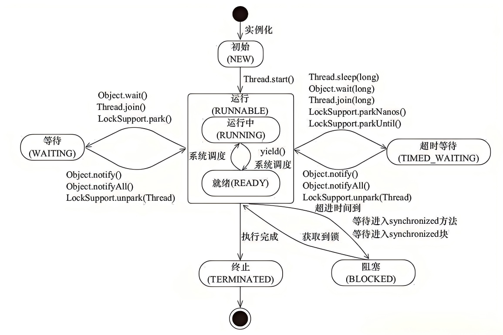

# JUC

本文档，参考教材使用《Java并发编程的艺术-第一版》

学习章节为：4，5，8，9，10，6，7，2，3，1，11

## 第4章

### 线程创建

**继承Thread**

能用，但现在不是主流。因为任务和线程绑死了，扩展性差。

```java
class MyThread extends Thread {
    @Override
    public void run() {
        System.out.println("running");
    }
}

用法：
new MyThread().start();
```


**实现Runnable**

这是基础主流写法。因为它把任务、执行线程分开了。

```java
Runnable task = () -> System.out.println("running");

new Thread(task).start();
```


**实现Callable**

这是“有返回值任务”的标准写法。

```java
Callable<Integer> task = () -> 100;

// 它不能直接给 `Thread`，一般给线程池：
ExecutorService pool = Executors.newFixedThreadPool(2);
Future<Integer> future = pool.submit(task);
System.out.println(future.get());
pool.shutdown();
```

实际开发怎么选

- 临时 demo：`Thread` / `Runnable`
- 正式业务：线程池 + `Runnable` / `Callable`

一句话：

项目里重点不是“创建线程”，而是“提交任务”。

### start()和run()必须彻底分清

t.run()只是普通方法调用，在当前线程执行。

t.start()才会真正启动新线程。

所以：

- run()：同步调用
- start()：异步启动

### join()

join()本质上就是：等待另一个线程执行完。

```java
// 执行顺序一定是：
// child done
// main done
Thread t = new Thread(() -> {
    try {
        Thread.sleep(1000);
    } catch (InterruptedException e) {
        Thread.currentThread().interrupt();
    }
    System.out.println("child done");
});

t.start();
t.join();
System.out.println("main done");
```

### 中断

interrupt()的本质是：给线程一个中断信号。不是：立刻暴力停止线程。

```java
Thread t = new Thread(() -> {
    while (!Thread.currentThread().isInterrupted()) {
        // work
    }
    System.out.println("stopped");
});

t.start();
// 这里线程能不能停，取决于代码有没有响应中断。
t.interrupt();
```

interrupt()：给线程发中断信号。

isInterrupted()：判断线程是否被中断，不清除标记。

Thread.interrupted()：判断当前线程是否被中断，并且**清除标记**。


### wait / notify / notifyAll

它们是基于对象监视器的等待/唤醒机制。

- 必须在 synchronized内调用，否则会抛 IllegalMonitorStateException

- wait()会释放锁，这是关键，否则别人永远进不来修改条件。

- notify()只唤醒一个等待线程，但唤醒谁不确定。

- 等待条件必须用 while，不要用 if，因为有虚假唤醒，也可能被唤醒后条件又不满足了。

```java
final Object lock = new Object();

Thread t1 = new Thread(() -> {
    synchronized (lock) {
        while (!ready) {
            try {
                lock.wait();
            } catch (InterruptedException e) {
                Thread.currentThread().interrupt();
                return;
            }
        }
        System.out.println("continue");
    }
});

Thread t2 = new Thread(() -> {
    synchronized (lock) {
        ready = true;
        lock.notifyAll();
    }
});
```

### 线程状态



最关键的区分

BLOCKED：在等监视器锁，比如等进入 synchronized。

WAITING：无限等待别人唤醒，比如：

- Object.wait()
- Thread.join()
- LockSupport.park()

TIMED_WAITING：带超时等待，比如：

- sleep()
- wait(timeout)
- join(timeout)


## 第5章

### synchronized

synchronized是Java内置互斥同步机制。它能保证：

- 原子性
- 可见性
- 有序性

同步代码块

```java
synchronized (lock) {
    // critical section
}
```

同步实例方法

```java
// 锁的是this
public synchronized void m() {
}
```

同步静态方法

```java
// 锁的是Class对象
public static synchronized void m() {
}
```


synchronized锁的是对象，不是代码。是否互斥，关键看：

- 是不是同一把锁
- 执行时间是否重叠


最常见使用场景：

简单共享变量保护

```java
private int count = 0;

public synchronized void inc() {
    count++;
}
```

复合操作保护

```java
public synchronized void withdraw(int amount) {
    if (balance >= amount) {
        balance -= amount;
    }
}
```

很多老印象说 `synchronized` 很重，这个说法现在不能机械地讲。现代 JVM 已经做了很多优化。

今天更准确的说法是：

- 简单同步场景，synchronized完全够用
- 需要高级控制时，再考虑ReentrantLock


### Lock & ReentrantLock

Lock是接口，ReentrantLock是最常用实现。

```java
private final ReentrantLock lock = new ReentrantLock();

public void add() {
    lock.lock();
    try {
        count++;
    } finally {
        lock.unlock();
    }
}
```

为什么有了synchronized还需要它？因为它更灵活。

ReentrantLock提供的关键能力

- tryLock()
- tryLock(timeout, unit)
- lockInterruptibly()
- 公平锁
- 多个Condition

这几个能力，很多都是 synchronized不好直接做的。

------

### 什么叫可重入

同一个线程已经拿到锁后，还能再次进入同一把锁保护的代码，不会把自己锁死。

synchronized也是可重入的。
所以“可重入”不是 ReentrantLock独有，只是它名字里带了。

------

### 什么时候优先用ReentrantLock

- 需要尝试拿锁
- 需要可中断拿锁
- 需要多个等待条件
- 需要公平锁
- 临界区控制比较复杂

### ReentrantLock的几个高频方法

lock()：普通加锁。拿不到就等。

tryLock()：尝试拿锁，拿不到立刻返回。

tryLock(timeout, unit)：限时等锁。

lockInterruptibly()：等待锁时可响应中断。这在取消任务时很有用。

### Condition

Condition是 Lock体系里的等待/唤醒工具，相当于 wait/notify的升级版。

```java
private final ReentrantLock lock = new ReentrantLock();
private final Condition notEmpty = lock.newCondition();

public void awaitData() throws InterruptedException {
    lock.lock();
    try {
        while (!ready) {
            notEmpty.await();
        }
    } finally {
        lock.unlock();
    }
}

public void signalData() {
    lock.lock();
    try {
        ready = true;
        notEmpty.signalAll();
    } finally {
        lock.unlock();
    }
}

```

### ReadWriteLock/ReentrantReadWriteLock

它解决的问题：读多写少场景下，提高并发度。

思想：

- 读锁：共享
- 写锁：独占

什么时候适合：

- 缓存
- 配置
- 字典表
- 读远多于写的数据对象

什么时候不要乱用：

- 写不少
- 临界区很短
- 逻辑复杂

读写锁不一定比普通锁更划算。

一句话：读写锁适合“读多写少 + 临界区值得分离”的场景。

```java
private final ReentrantReadWriteLock rwLock = new ReentrantReadWriteLock();

public Object read() {
    rwLock.readLock().lock();
    try {
        return data;
    } finally {
        rwLock.readLock().unlock();
    }
}

public void write(Object newData) {
    rwLock.writeLock().lock();
    try {
        data = newData;
    } finally {
        rwLock.writeLock().unlock();
    }
}
```

### StampedLock

解决的问题：也是读多写少，但它想进一步优化读性能。

它有三种模式：

- 写锁
- 悲观读
- 乐观读

乐观读的味道

先不真正加重锁，先读，读完再校验期间有没有写发生。

什么时候值得知道

- 高读少写
- 追求更高读性能
- 能接受使用复杂度更高

它比 ReentrantReadWriteLock更进阶，但也更难用。
并不是日常CRUD项目首选。